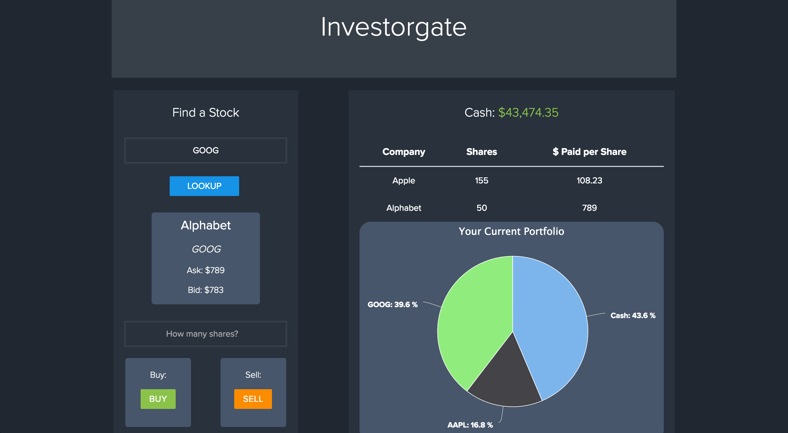
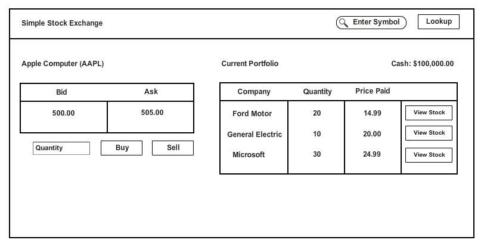

# Investorgate

This is an app built with React, Redux, and Jest for investors who want to trade stocks on public stock exchanges.

[](https://www.youtube.com/embed/_sdDhlRAaE0)

## Getting Started Locally

```
git clone git@github.com:kelsonic/Investorgate.git

cd Investorgate

npm install (may take awhile...)

npm start
```

## Usage

View the website in production at awebsitetocome.com.

## User Stories

(MVP) As a user, I want to:

* View my cash
* Purchase stocks
* View my stocks
* Sell my stocks

#### Wireframe



## Contributing

1. Fork it!
2. Create your feature branch: `git checkout -b my-new-feature`
3. Commit your changes: `git commit -am 'Add some feature'`
4. Push to the branch: `git push origin my-new-feature`
5. Submit a pull request :D

## History

This is a coding challenge from a FinTech startup for a frontend position in the US.

## TODOs

1. In the app's current form, the pie chart is not keeping track of the real-time value of the stocks in the portfolio. Instead, it is displaying the price paid for each stock compared to the available cash you have left.

2. For each component, a styles file should be created that contains the specific styles for the particular component.

<!-- View this boilerplate to start implementing this feature: https://github.com/mxstbr/react-boilerplate/tree/master/docs/css -->

## Credits

* [kelsonic](https://github.com/kelsonic)

## License

MIT License. View it [here](LICENSE).